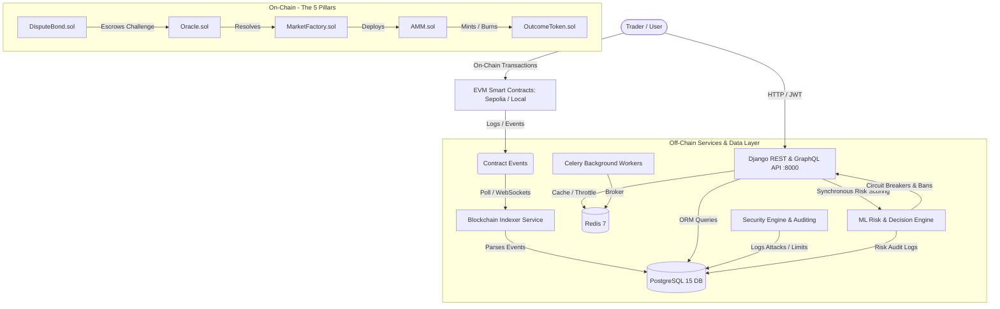

# 🚀 PredictHub / PredictBack Protocol

A robust, enterprise-grade, decentralized community prediction market platform combining **on-chain Ethereum smart contracts**, an **event-driven blockchain indexer**, a **high-throughput Django REST & GraphQL backend**, an **AI/ML risk and market manipulation detection engine**, and an **integrated security monitoring framework**.

---

## 🛠️ Technology Stack, Apps, Features, Libraries & Frameworks

As requested, here is the complete breakdown of all **applications**, **features**, **libraries**, and **frameworks** powering the PredictBack ecosystem.

### 1. Applications & Services
The ecosystem is structured as a distributed microservice architecture managed via Docker Compose:

* **[web](file:///c:/Users/Iman/Desktop/Stuff/Pdf_and_Docs/UNI/VIRTUAL/final/PredictBack/backend_api/Dockerfile)**: Core API service running Django 5.2.8 and Django REST Framework on port `8000`, serving both REST and GraphQL endpoints.
* **[indexer](file:///c:/Users/Iman/Desktop/Stuff/Pdf_and_Docs/UNI/VIRTUAL/final/PredictBack/backend_api/api/indexer/management/commands/listen_events.py)**: Autonomous blockchain listener that polls Ethereum/Sepolia nodes, decodes smart contract event logs, and synchronizes on-chain states into the relational database.
* **[celery](file:///c:/Users/Iman/Desktop/Stuff/Pdf_and_Docs/UNI/VIRTUAL/final/PredictBack/infrastructure/docker-compose.yml#L77-L106)**: Distributed asynchronous task worker handling background computations, ML feature extraction, and off-chain sync.
* **[celery-beat](file:///c:/Users/Iman/Desktop/Stuff/Pdf_and_Docs/UNI/VIRTUAL/final/PredictBack/infrastructure/docker-compose.yml#L107-L136)**: Periodic task scheduler coordinating regular health checks, cron routines, and indexer heartbeats.
* **[db (PostgreSQL 15)](file:///c:/Users/Iman/Desktop/Stuff/Pdf_and_Docs/UNI/VIRTUAL/final/PredictBack/infrastructure/docker-compose.yml#L2-L17)**: Primary relational database storing users, markets, trades, positions, security audits, and on-chain transaction logs.
* **[redis (Redis 7 Alpine)](file:///c:/Users/Iman/Desktop/Stuff/Pdf_and_Docs/UNI/VIRTUAL/final/PredictBack/infrastructure/docker-compose.yml#L31-L40)**: In-memory key-value data store used as Celery's message broker, cache backend, and rate-limiting counter store.
* **[pgadmin (pgAdmin 4)](file:///c:/Users/Iman/Desktop/Stuff/Pdf_and_Docs/UNI/VIRTUAL/final/PredictBack/infrastructure/docker-compose.yml#L18-L30)**: Web-based PostgreSQL database administration console exposed on port `5050`.
* **[ml_service](file:///c:/Users/Iman/Desktop/Stuff/Pdf_and_Docs/UNI/VIRTUAL/final/PredictBack/ml_service)**: Real-time data science engine providing trade anomaly scoring, circuit breaker triggers, and platform health alerts.
* **[security_engine](file:///c:/Users/Iman/Desktop/Stuff/Pdf_and_Docs/UNI/VIRTUAL/final/PredictBack/security_engine)**: Dedicated audit and intrusion detection subsystem tracking rate-limit breaches, suspicious behaviors, and auth attempts.
* **[smart_contracts](file:///c:/Users/Iman/Desktop/Stuff/Pdf_and_Docs/UNI/VIRTUAL/final/PredictBack/smart_contracts)**: Hardhat- and Brownie-managed Solidity contracts deployed to Sepolia testnet or local EVM nodes.

---

### 2. Core Features & Capabilities

* **Decentralized Prediction Markets**:
  * Dynamic market creation with customizable categories, expiration timestamps, and knowledge tags.
  * Binary outcome shares (YES / NO) managed via ERC-20 outcome tokens.
  * Constant Product Automated Market Maker (AMM) for automated on-chain liquidity and continuous price discovery.
* **Multi-Tier AI / ML Risk Engine**:
  * **Model 1 (Trade Risk Assessment)**: Pre-execution heuristic & Isolation Forest scoring analyzing velocity, stake-to-wealth ratios, wallet maturity, and failed auth history.
  * **Automated Circuit Breaker & Auto-Ban**: Automatically rejects transactions with risk score `> 0.85` and bans malicious actors with score `> 0.90`.
  * **Model 2 (Position Exposure)**: Quantifies platform-wide and user-specific exposure and Value-at-Risk (VaR).
  * **Model 3 (Token Behavior Forecasting)**: XGBoost gradient boosted classifier predicting price directional trends (`UP`, `DOWN`, `FLAT`).
  * **Model 4 (Market Manipulation Detection)**: NetworkX graph clique analysis detecting wash trading, sybil rings, and pump-and-dump schemes.
  * **Model 5 (Platform Health Early Warning System - MHEWS)**: Meta-model aggregating signals to measure systemic stress index and contagion risks.
  * **Model Explainability**: Integrations with SHAP and LIME to interpret risk scores transparently.
* **Resilient Blockchain Indexing & JSON-RPC**:
  * Real-time polling service with idempotency checks to prevent duplicate event ingestion.
  * Fallback webhook endpoints (`/api/webhook/onchain/`) for push-based updates.
  * JSON-RPC 2.0 server (`/api/indexer/rpc/`) and historical backfill scripts (`backfill_script.py`).
* **Enterprise Security & Role-Based Access Control (RBAC)**:
  * User tiers: `ADMIN`, `TRADER`, `WHALE`, and `BLOCKED`.
  * Defense-in-depth middleware defending against SQL Injection (SQLi), Cross-Site Scripting (XSS), and brute force attacks.
  * Leaky-bucket / sliding window rate limiting (100 req/hr anonymous, 1000 req/hr authenticated).
  * Centralized tamper-evident security audit logging into database and structured JSONL logs.
* **Dispute Resolution & Collateralized Escrow**:
  * 48-hour dispute window post-market resolution.
  * Bond-backed dispute challenges preventing griefing and spam.
* **Dual API Paradigm**:
  * Full REST API with JWT authentication.
  * GraphQL API powered by Strawberry for flexible client queries.
  * Interactive Swagger UI (`/swagger/`) and ReDoc (`/redoc/`) API documentation.

---

### 3. Libraries & Dependencies

#### Python Backend & Web
* **Django (`5.2.8`)**: Core high-level web framework.
* **djangorestframework (`3.15.2`)**: REST API toolkit with serializers, viewsets, and throttle controls.
* **djangorestframework-simplejwt (`5.3.1`)**: JSON Web Token (JWT) authentication backend.
* **django-cors-headers (`4.6.0`)**: Cross-Origin Resource Sharing (CORS) management.
* **django-environ (`0.11.2`)**: Twelve-factor environment configuration.
* **drf-yasg (`1.21.7`)**: Automated Swagger / OpenAPI 2.0 documentation generator.
* **strawberry-graphql-django (`0.15.0`)**: Pythonic GraphQL implementation integrated with Django ORM.
* **requests (`2.31.0`)**: HTTP client for external integrations.

#### Database & Asynchronous Task Processing
* **psycopg2-binary (`2.9.10`)**: PostgreSQL database adapter for Python.
* **celery (`5.4.0`)**: Distributed task queue for asynchronous and scheduled workloads.
* **redis (`5.2.0`)**: Python Redis client for caching and message queuing.

#### Web3 & Blockchain
* **web3 (`7.14.0`)**: Ethereum RPC interaction library for smart contract calls and event filtering.
* **websockets (`14.1`)**: Low-latency WebSocket protocol implementation for on-chain subscriptions.
* **@openzeppelin/contracts (`^5.0.0`)**: Audited open-source smart contract standards (ERC-20, Ownable, ReentrancyGuard).
* **@nomicfoundation/hardhat-toolbox (`^4.0.0`)**: Ethereum development suite for contract compilation, testing, and deployment.
* **@nomicfoundation/hardhat-verify (`^2.0.0`)**: Hardhat plugin for Etherscan contract verification.

#### Machine Learning & Data Science
* **scikit-learn (`1.6.0`)**: Isolation Forest anomaly detection, preprocessing pipelines, and clustering.
* **xgboost (`3.1.2`)**: Scalable gradient boosted decision trees for token trajectory forecasting.
* **pandas (`2.2.3`)**: High-performance data structures and time-series manipulation.
* **numpy (`<2.0`)**: Numerical computing foundation (pinned for SHAP/LIME compatibility).
* **scipy (`1.16.3`)**: Scientific algorithms, statistical distributions, and hypothesis tests.
* **networkx (`3.3`)**: Graph analytics and clique detection for collusion rings.
* **joblib (`1.4.2`)**: Model serialization, caching, and parallel processing.
* **shap (`0.45.1`)**: Shapley Additive Explanations for feature contribution calculation.
* **lime (`0.2.0.1`)**: Local Interpretable Model-agnostic Explanations.
* **matplotlib (`3.9.2`) & seaborn (`0.13.2`)**: Data visualization and risk heatmaps.
* **jupyter (`1.0.0`) & ipykernel (`6.29.4`)**: Interactive model research and exploratory analysis.

#### Testing & Code Quality
* **pytest (`8.3.4`)**: Modern testing framework.
* **pytest-django (`4.9.0`)**: Pytest plugin for Django fixtures and database isolation.
* **pytest-cov (`6.0.0`)**: Test coverage measurement and reporting.

---

### 4. Frameworks & Platforms

| Category | Technology | Version | Purpose |
| :--- | :--- | :--- | :--- |
| **Backend Framework** | [Django](https://www.djangoproject.com/) | 5.2.8 | Primary MVC web framework, ORM, and auth engine |
| **API Framework** | [Django REST Framework](https://www.django-rest-framework.org/) | 3.15.2 | High-throughput REST API viewsets, serializers, throttling |
| **GraphQL Framework** | [Strawberry GraphQL](https://strawberry.rocks/) | 0.15.0 | Modern code-first GraphQL schema & resolvers |
| **Task Queue** | [Celery](https://docs.celeryq.dev/) | 5.4.0 | Asynchronous worker processes & Celery Beat scheduling |
| **Blockchain Dev** | [Hardhat](https://hardhat.org/) & [Brownie](https://eth-brownie.readthedocs.io/) | 2.27.0 | Solidity compiling, deployment scripts, EVM testing |
| **Smart Contract Lang** | [Solidity](https://soliditylang.org/) | ^0.8.20 | On-chain prediction market logic and token contracts |
| **Relational Database** | [PostgreSQL](https://www.postgresql.org/) | 15 | Persistent ACID-compliant data storage |
| **Cache & Broker** | [Redis](https://redis.io/) | 7 Alpine | Fast in-memory messaging and rate limit tracking |
| **Containerization** | [Docker & Docker Compose](https://www.docker.com/) | 20.10+ / 2.0+ | Microservice container orchestration and reproducible builds |

---

## 🏛️ System Architecture



---

## 📂 Repository Directory Layout

```
PredictBack/
├── README.md                      # Primary project documentation
├── TESTING_GUIDE.md               # Master test guide (automated & manual E2E procedures)
├── backfill_script.py             # Standalone on-chain historical backfill runner
├── backend_api/                   # Core Django web application
│   ├── api/                       # Domain-specific applications
│   │   ├── admin/                 # Admin metrics and system dashboards
│   │   ├── analytics/             # Leaderboards and performance aggregation
│   │   ├── disputes/              # Resolution dispute and bond models
│   │   ├── indexer/               # Blockchain event ingestion and JSON-RPC
│   │   ├── liquidity/             # Liquidity events and pool models
│   │   ├── markets/               # Market creation, metadata, and lifecycle
│   │   ├── ml_api/                # ML inference endpoints
│   │   ├── positions/             # User positions (YES/NO tokens, PnL)
│   │   ├── trades/                # Trade execution and order validation
│   │   ├── users/                 # Custom User model, JWT authentication, RBAC
│   │   └── webhooks/              # On-chain webhook ingestion
│   ├── core/                      # Project settings, URLs, middleware, and GraphQL schema
│   ├── manage.py                  # Django management executable
│   ├── requirements.txt           # Python dependency manifest
│   └── Dockerfile                 # Docker build definition for web/celery/indexer
├── database_layer/                # Schema documentation and Entity Relationship Diagrams
│   ├── erd.md                     # Markdown ERD with relationship diagrams
│   └── docs/                      # Database structure and migration specifications
├── flows/                         # Architecture flowcharts and Mermaid specifications
│   └── architecture_flow.mmd      # High-level architecture diagram
├── infrastructure/                # Containerization and production orchestration
│   ├── docker-compose.yml         # Multi-container orchestration (web, db, redis, celery, indexer)
│   └── .env                       # Environment configuration template
├── ml_service/                    # Machine Learning & AI risk decision subsystem
│   ├── training/                  # Model loaders, heuristic algorithms, notebooks, and models
│   │   ├── notebooks/             # Jupyter notebooks for Models 2, 3, 4, 5
│   │   ├── model_loader.py        # Dynamic inference loader with fallbacks
│   │   ├── models.py              # ML database models (TradeRiskPrediction)
│   │   └── exposure.py            # VaR and position exposure calculations
├── security_engine/               # Security monitoring and threat auditing
│   ├── models.py                  # SecurityLog, LoginAttempt models
│   ├── views.py                   # Security dashboards and query endpoints
│   └── urls.py                    # Security API route mappings
├── smart_contracts/               # Solidity contracts, test suites, and deployment scripts
│   ├── contracts/                 # MarketFactory, AMM, OutcomeToken, Oracle, DisputeBond
│   ├── hardhat.config.js          # Hardhat configuration
│   ├── package.json               # Smart contract Node.js dependencies
│   └── scripts/                   # Deployment and interaction scripts
├── scripts/                       # System lifecycle scripts
│   ├── rebuild_system.ps1         # Windows PowerShell full-stack rebuild automation
│   └── rebuild_system.sh          # Bash Unix full-stack rebuild automation
└── tests/                         # Centralized test suites
    ├── master_integration_suite.py# Comprehensive Dockerized 5-tier integration suite
    ├── demo_security.py           # Security red-team attack simulation
    └── generate_security_ml_data.py# Synthetic security and ML test vector generator
```

---

## 🧩 Deep Dive into Subsystems

### 1. Smart Contracts: The 5 Pillars
The decentralized prediction protocol is anchored by five cooperating Solidity contracts:

1. **[MarketFactory.sol](file:///c:/Users/Iman/Desktop/Stuff/Pdf_and_Docs/UNI/VIRTUAL/final/PredictBack/smart_contracts/contracts/MarketFactory.sol)**: Deploys individual prediction markets, initializes AMM liquidity pairs, and emits `MarketCreated` events.
2. **[AMM.sol](file:///c:/Users/Iman/Desktop/Stuff/Pdf_and_Docs/UNI/VIRTUAL/final/PredictBack/smart_contracts/contracts/AMM.sol)**: Implements automated liquidity formulas, manages collateral reserves, and mints/burns outcome tokens dynamically during trades.
3. **[OutcomeToken.sol](file:///c:/Users/Iman/Desktop/Stuff/Pdf_and_Docs/UNI/VIRTUAL/final/PredictBack/smart_contracts/contracts/OutcomeToken.sol)**: ERC-20 compliant outcome tokens representing fractional claims on YES or NO settlements.
4. **[Oracle.sol](file:///c:/Users/Iman/Desktop/Stuff/Pdf_and_Docs/UNI/VIRTUAL/final/PredictBack/smart_contracts/contracts/Oracle.sol)**: Secure resolution interface for reporting the definitive real-world outcome of a prediction market.
5. **[DisputeBond.sol](file:///c:/Users/Iman/Desktop/Stuff/Pdf_and_Docs/UNI/VIRTUAL/final/PredictBack/smart_contracts/contracts/DisputeBond.sol)**: Escrow mechanism requiring challenger bond deposits during the 48-hour dispute window to challenge an oracle resolution.

### 2. Machine Learning Decision Engine
The ML service operates both in real-time during transaction processing and offline for systemic platform analytics:

* **Model 1: Trade Risk Prediction**:
  * Evaluates each trade synchronously before DB persistence.
  * Formulated via heuristic velocity checks and Isolation Forest anomaly detection:
    $$\text{Risk Score} = (\text{failed\_logins} \times 0.2) + (\text{velocity\_factor} \times 0.3) + (\text{stake\_factor} \times 0.5) + \text{age\_penalty}$$
  * Thresholds:
    * `Score <= 0.50`: **LOW** (Approved).
    * `0.50 < Score <= 0.85`: **MEDIUM** (Approved with audit tag).
    * `Score > 0.85`: **HIGH** (Rejected via Circuit Breaker).
    * `Score > 0.90`: **CRITICAL** (Rejected and user immediately **AUTO-BANNED**).
* **Model 2: Position Exposure & Liquidity**: Computes portfolio concentration risk and Value-at-Risk across concurrent positions.
* **Model 3: Token Behavior Forecasting**: XGBoost classifier trained on historical price paths to project expected directionality (`UP`, `DOWN`, `FLAT`).
* **Model 4: Market Manipulation Detection**: Graph algorithms using [NetworkX](https://networkx.org/) to detect cyclical wash trades and wallet clusters coordinating artificial volume.
* **Model 5: Platform Health Early Warning System (MHEWS)**: Meta-classifier computing continuous systemic stress metrics and liquidity risk indices.

### 3. Security Engine & Red-Team Hardening
The security subsystem safeguards platform integrity:
* **Custom Middleware Stack**:
  * [LoggingMiddleware](file:///c:/Users/Iman/Desktop/Stuff/Pdf_and_Docs/UNI/VIRTUAL/final/PredictBack/backend_api/core/utils/middleware.py): Logs incoming request metadata.
  * [ErrorHandlingMiddleware](file:///c:/Users/Iman/Desktop/Stuff/Pdf_and_Docs/UNI/VIRTUAL/final/PredictBack/backend_api/core/utils/middleware.py): Sanitizes exceptions, preventing sensitive stack-trace leakage.
  * [SecurityLoggingMiddleware](file:///c:/Users/Iman/Desktop/Stuff/Pdf_and_Docs/UNI/VIRTUAL/final/PredictBack/backend_api/core/utils/middleware.py): Catches HTTP 429 (Rate Limit Exceeded) and unauthorized requests, persisting them directly into `SecurityLog`.
* **RBAC & Threat Mitigation**:
  * Blocks users identified as malicious (`Role.BLOCKED`).
  * Enforces DRF throttling against brute force login and credential stuffing.
  * Defends against SQL injection through Django ORM parameterization and strict serializer validation.

### 4. Blockchain Indexer Subsystem
Located in [backend_api/api/indexer](file:///c:/Users/Iman/Desktop/Stuff/Pdf_and_Docs/UNI/VIRTUAL/final/PredictBack/backend_api/api/indexer):
* Runs continuous polling loop via `python manage.py listen_events --poll-interval 12`.
* Maps on-chain events (`MarketCreated`, `TradeExecuted`, `LiquidityAdded`, `MarketResolved`) to Django models.
* Stores immutable event receipts in `OnchainEventLog` and transaction records in `OnchainTransaction`.
* Exposes a JSON-RPC 2.0 API (`/api/indexer/rpc/`) and provides admin heartbeat health monitoring.

---

## ⚡ Quick Start & Setup Guide

### Prerequisites
* [Docker Desktop](https://www.docker.com/products/docker-desktop/) (v20.10+ with Compose v2.0+)
* [Node.js](https://nodejs.org/) (v18+ for smart contracts)
* [Python](https://www.python.org/) (v3.11+ for local virtual environments)

---

### Method A: One-Click System Rebuild (Recommended)

To wipe old volumes, apply clean database migrations, and boot all microservices:

**On Windows (PowerShell):**
```powershell
.\scripts\rebuild_system.ps1
```

**On Linux / macOS (Bash):**
```bash
chmod +x ./scripts/rebuild_system.sh
./scripts/rebuild_system.sh
```

---

### Method B: Manual Docker Compose

1. **Clone and enter repository**:
   ```bash
   cd PredictBack
   ```

2. **Configure environment variables**:
   Ensure [infrastructure/.env](file:///c:/Users/Iman/Desktop/Stuff/Pdf_and_Docs/UNI/VIRTUAL/final/PredictBack/infrastructure/.env) exists with your database and Web3 credentials:
   ```env
   POSTGRES_DB=predicthub_db
   POSTGRES_USER=postgres
   POSTGRES_PASSWORD=postgres
   POSTGRES_HOST=db
   POSTGRES_PORT=5432
   CELERY_BROKER_URL=redis://redis:6379/0
   CELERY_RESULT_BACKEND=redis://redis:6379/0
   WEB3_PROVIDER_HTTP=https://sepolia.infura.io/v3/YOUR_INFURA_KEY
   CHAIN_ID=11155111
   CONTRACT_ADDRESS=0xYourDeployedContractAddress
   ```

3. **Start infrastructure containers**:
   ```bash
   cd infrastructure
   docker-compose up -d
   ```

4. **Verify running containers**:
   ```bash
   docker-compose ps
   ```

---

## 🧪 Testing & Verification

The project includes an end-to-end Master Integration Test Suite validating all system layers.

### Run Automated Master Integration Suite
Execute the test runner inside the active `web` container:

```bash
docker-compose exec web python tests/tests/master_integration_suite.py
```

**What the Master Suite Verifies:**
* **Test 1**: PostgreSQL connectivity, migrations, and required table schema.
* **Test 2**: Smart contract event payload parsing and on-chain log persistence.
* **Test 3**: User registration flow, JWT token generation, and DB verification.
* **Test 4 (Red Team Simulation)**: Rate limit enforcement (429 handling), SQL injection rejection, and security audit log creation.
* **Test 5**: ML risk inference, scoring ranges, and ML REST API responses.

### Run Python Unit & API Tests
```bash
docker-compose exec web pytest
```

### Run Smart Contract Tests
```bash
cd smart_contracts
npm install
npx hardhat test
```

For comprehensive manual verification workflows and curl examples, consult the [TESTING_GUIDE.md](file:///c:/Users/Iman/Desktop/Stuff/Pdf_and_Docs/UNI/VIRTUAL/final/PredictBack/TESTING_GUIDE.md).

---

## 📡 API Reference & Documentation

When running locally, interactive documentation and exploration interfaces are available at:

| Interface | URL | Purpose |
| :--- | :--- | :--- |
| **Swagger UI** | [http://localhost:8000/swagger/](http://localhost:8000/swagger/) | Interactive OpenAPI 2.0 REST specification |
| **ReDoc UI** | [http://localhost:8000/redoc/](http://localhost:8000/redoc/) | Detailed, human-readable API documentation |
| **GraphQL Playground** | [http://localhost:8000/graphql/](http://localhost:8000/graphql/) | Interactive GraphQL schema explorer and query runner |
| **Django Admin** | [http://localhost:8000/admin/](http://localhost:8000/admin/) | Back-office management and indexer monitoring |
| **pgAdmin 4** | [http://localhost:5050/](http://localhost:5050/) | Web UI for PostgreSQL database management |

### Key API Endpoint Summary

* **Authentication & Users**:
  * `POST /api/token/` - Obtain JWT access & refresh tokens
  * `POST /api/token/refresh/` - Refresh JWT access token
  * `POST /api/users/signup/` - Register new user
  * `GET /api/users/me/` - Retrieve authenticated user profile
* **Markets & Trading**:
  * `GET /api/markets/` - List all markets (filters: `status`, `category`)
  * `POST /api/markets/create/` - Create new prediction market
  * `POST /api/trades/` - Place trade (triggers ML risk check & circuit breaker)
  * `GET /api/positions/` - List user positions & P&L
* **Liquidity & Disputes**:
  * `POST /api/liquidity/add/` - Provide liquidity to AMM pool
  * `POST /api/disputes/create/` - Submit resolution dispute with bond collateral
* **Machine Learning & Admin**:
  * `POST /api/ml/risk/predict/` - Evaluate trade risk score
  * `GET /api/ml/token-behavior/market/{id}/` - Predict token price direction
  * `GET /api/ml/health/` - Systemic platform stress and health metrics
  * `GET /api/admin/logs/` - Retrieve security incident and rate limit audit logs
* **Blockchain Indexer**:
  * `POST /api/indexer/rpc/` - JSON-RPC 2.0 query endpoint
  * `GET /api/indexer/status/` - Indexer sync health and last block processed
  * `POST /api/webhook/onchain/` - External webhook event ingestion

---

## 📜 License

This project is licensed under the MIT License - see the repository license details for more information.
